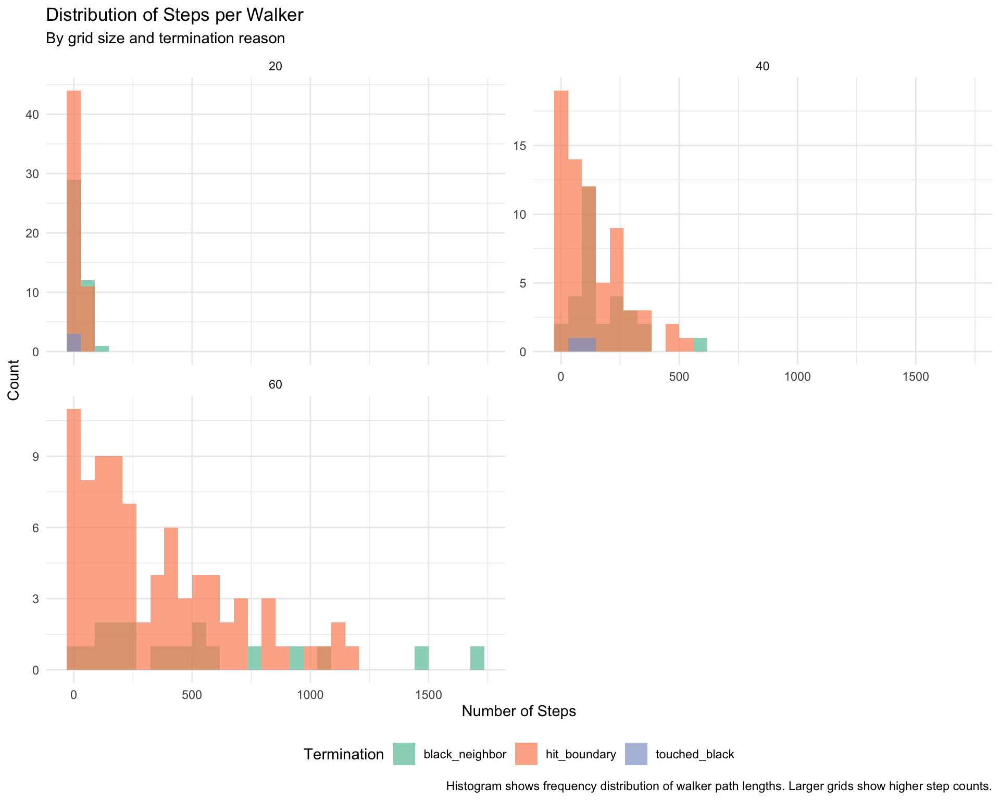
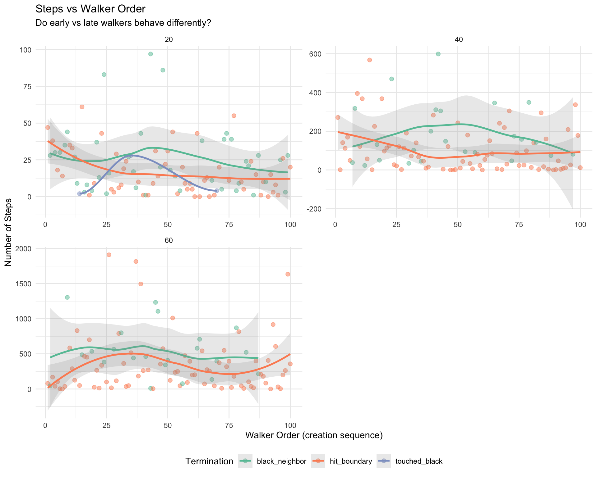
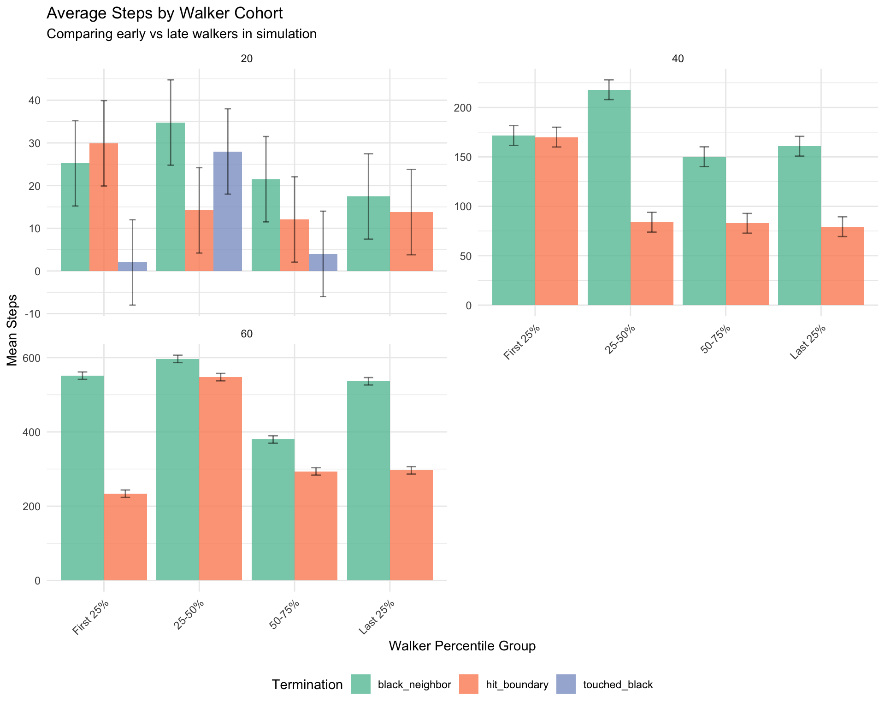

# Step Distribution Analysis with Targets

# Step Distribution Analysis with Targets

Statistical analysis of random walk step distributions across grid sizes
and walker counts using targets pipeline

## Overview

This vignette uses the `targets` package to analyze how the distribution
of steps per walker varies across different conditions:

- **Grid size**: How does grid size affect path lengths?
- **Walker order**: Do early vs late walkers differ?
- **Simulation progress**: Does behavior change as the simulation
  progresses?
- **Termination reason**: How do paths differ by termination type?

We use `targets` for reproducible, cacheable analysis with dynamic
branching.

## Load Packages

Show code

``` r
# Load development version of randomwalk
if (!requireNamespace("randomwalk", quietly = TRUE)) {
  devtools::load_all(".")  # Use current directory, don't need 'here' package
}

library(randomwalk)
library(ggplot2)
library(dplyr)
library(tidyr)
library(purrr)
library(DT)  # For interactive sortable tables
```

## Targets Pipeline

### Define Analysis Functions

Show code

``` r
#' Extract step data from simulation result
#'
#' @param result Simulation result from run_simulation()
#' @return Data frame with walker-level step information
extract_step_data <- function(result) {
  walkers <- result$walkers
  grid_size <- result$parameters$grid_size

  # Extract data for each walker
  data <- map_dfr(seq_along(walkers), function(i) {
    walker <- walkers[[i]]
    tibble(
      walker_id = i,
      walker_order = i,  # Order in which walker was created
      steps = walker$steps,
      termination_reason = walker$termination_reason %||% "unknown",
      grid_size = grid_size,
      # Calculate percentile of walker in simulation
      walker_percentile = i / length(walkers) * 100
    )
  })

  data
}

#' Analyze step distributions by termination reason
#'
#' @param step_data Data frame from extract_step_data()
#' @return Summary statistics by termination reason and grid size
analyze_by_termination <- function(step_data) {
  step_data %>%
    group_by(grid_size, termination_reason) %>%
    summarise(
      n_walkers = n(),
      mean_steps = mean(steps),
      median_steps = median(steps),
      sd_steps = sd(steps),
      min_steps = min(steps),
      max_steps = max(steps),
      q25_steps = quantile(steps, 0.25),
      q75_steps = quantile(steps, 0.75),
      .groups = "drop"
    )
}

#' Analyze step distributions by walker order
#'
#' @param step_data Data frame from extract_step_data()
#' @param n_groups Number of percentile groups (default 10 for deciles)
#' @return Summary statistics by walker percentile bins
analyze_by_walker_order <- function(step_data, n_groups = 10) {
  # Create percentile breaks (e.g., 10 groups = deciles: 0-10%, 10-20%, ..., 90-100%)
  breaks <- seq(0, 100, length.out = n_groups + 1)

  # Create labels for groups
  labels <- sapply(seq_len(n_groups), function(i) {
    sprintf("%d-%d%%", breaks[i], breaks[i + 1])
  })

  step_data %>%
    mutate(
      walker_group = cut(
        walker_percentile,
        breaks = breaks,
        labels = labels,
        include.lowest = TRUE
      )
    ) %>%
    group_by(grid_size, walker_group, termination_reason) %>%
    summarise(
      n_walkers = n(),
      mean_steps = mean(steps),
      median_steps = median(steps),
      .groups = "drop"
    )
}

#' Create visualization of step distributions
#'
#' @param step_data Data frame from extract_step_data()
#' @return ggplot object
plot_step_distributions <- function(step_data) {
  ggplot(step_data, aes(x = steps, fill = termination_reason)) +
    geom_histogram(bins = 30, alpha = 0.7, position = "identity") +
    facet_wrap(~grid_size, scales = "free_y", ncol = 2) +
    scale_fill_brewer(palette = "Set2", name = "Termination") +
    labs(
      title = "Distribution of Steps per Walker",
      subtitle = "By grid size and termination reason",
      x = "Number of Steps",
      y = "Count",
      caption = "Histogram shows frequency distribution of walker path lengths. Larger grids show higher step counts."
    ) +
    theme_minimal() +
    theme(legend.position = "bottom")
}

#' Create visualization of steps vs walker order
#'
#' @param step_data Data frame from extract_step_data()
#' @return ggplot object
plot_steps_by_order <- function(step_data) {
  ggplot(step_data, aes(x = walker_order, y = steps, color = termination_reason)) +
    geom_point(alpha = 0.5, size = 2) +
    geom_smooth(method = "loess", se = TRUE, alpha = 0.2) +
    facet_wrap(~grid_size, scales = "free", ncol = 2) +
    scale_color_brewer(palette = "Set2", name = "Termination") +
    labs(
      title = "Steps vs Walker Order Percentile",
      subtitle = "Do early vs late walkers behave differently?",
      x = "Walker Order Percentile (e.g., 50% = 50th walker out of 100)",
      y = "Number of Steps",
      caption = "Each point represents one walker. For 100 walkers, 50% corresponds to the 50th walker created."
    ) +
    theme_minimal() +
    theme(legend.position = "bottom")
}

#' Create visualization of average steps by walker percentile
#'
#' @param summary_data Summary data from analyze_by_walker_order()
#' @return ggplot object
plot_steps_by_percentile <- function(summary_data) {
  ggplot(summary_data, aes(x = walker_group, y = mean_steps, fill = termination_reason)) +
    geom_col(position = "dodge", alpha = 0.8) +
    geom_errorbar(
      aes(ymin = mean_steps - 10, ymax = mean_steps + 10),
      position = position_dodge(0.9),
      width = 0.2,
      alpha = 0.5
    ) +
    facet_wrap(~grid_size, scales = "free_y", ncol = 2) +
    scale_fill_brewer(palette = "Set2", name = "Termination") +
    labs(
      title = "Average Steps by Walker Cohort (Deciles)",
      subtitle = "Comparing walker performance across creation order percentiles",
      x = "Walker Percentile Group",
      y = "Mean Steps",
      caption = "Default shows 10 groups (deciles). Each bar represents walkers in that percentile range."
    ) +
    theme_minimal() +
    theme(
      legend.position = "bottom",
      axis.text.x = element_text(angle = 45, hjust = 1)
    )
}
```

### Define Targets Plan

Show code

``` r
# This would go in _targets.R file
library(targets)
library(tarchetypes)

# Set up parallel processing if available
tar_option_set(
  packages = c("randomwalk", "dplyr", "ggplot2", "purrr", "tidyr"),
  format = "rds"
)

# Define grid sizes to analyze
grid_sizes <- c(20, 40, 60, 80)

list(
  # Dynamic branching: Run simulations for each grid size
  tar_target(
    name = grid_size_values,
    command = grid_sizes
  ),

  tar_target(
    name = simulation_results,
    command = run_simulation(
      grid_size = grid_size_values,
      n_walkers = 200,
      neighborhood = "4-hood",
      boundary = "terminate",
      max_steps = 5000,
      workers = 0,
      verbose = FALSE
    ),
    pattern = map(grid_size_values),
    iteration = "list"
  ),

  # Extract step data from each simulation
  tar_target(
    name = step_data_by_grid,
    command = extract_step_data(simulation_results),
    pattern = map(simulation_results),
    iteration = "list"
  ),

  # Combine all step data
  tar_target(
    name = step_data_combined,
    command = bind_rows(step_data_by_grid)
  ),

  # Analysis: By termination reason
  tar_target(
    name = termination_summary,
    command = analyze_by_termination(step_data_combined)
  ),

  # Analysis: By walker order
  tar_target(
    name = walker_order_summary,
    command = analyze_by_walker_order(step_data_combined)
  ),

  # Visualizations
  tar_target(
    name = plot_distributions,
    command = plot_step_distributions(step_data_combined)
  ),

  tar_target(
    name = plot_by_order,
    command = plot_steps_by_order(step_data_combined)
  ),

  tar_target(
    name = plot_by_percentile,
    command = plot_steps_by_percentile(walker_order_summary)
  )
)
```

## Run Analysis

Show code

``` r
# Load pre-computed simulations from targets
# These are computed in _targets.R with set.seed(123) for reproducibility
library(targets)

simulation_results <- tar_read(step_dist_sims)
grid_sizes <- tar_read(step_dist_grid_sizes)
```

Show code

``` r
# Extract step data
step_data_list <- map(simulation_results, extract_step_data)
step_data_combined <- bind_rows(step_data_list)

# Preview data
head(step_data_combined, 10)
```

    # A tibble: 10 × 6
       walker_id walker_order steps termination_reason grid_size walker_percentile
           <int>        <int> <int> <chr>                  <dbl>             <dbl>
     1         1            1    47 hit_boundary              20                 1
     2         2            2    28 black_neighbor            20                 2
     3         3            3    38 hit_boundary              20                 3
     4         4            4    30 black_neighbor            20                 4
     5         5            5    18 hit_boundary              20                 5
     6         6            6    30 black_neighbor            20                 6
     7         7            7    14 hit_boundary              20                 7
     8         8            8    35 black_neighbor            20                 8
     9         9            9    44 black_neighbor            20                 9
    10        10           10    35 hit_boundary              20                10

## Results

### Summary Statistics by Termination Reason

Show code

``` r
termination_summary <- analyze_by_termination(step_data_combined)

# Add normalized columns (steps per grid unit)
termination_summary_display <- termination_summary %>%
  mutate(
    mean_steps_per_grid = mean_steps / grid_size,
    median_steps_per_grid = median_steps / grid_size
  ) %>%
  # Reorder columns to put normalized after raw
  select(
    grid_size, termination_reason, n_walkers,
    mean_steps, mean_steps_per_grid,
    median_steps, median_steps_per_grid,
    everything()
  )

# Create interactive sortable table with DT::datatable
DT::datatable(
  termination_summary_display,
  caption = htmltools::tags$caption(
    style = "caption-side: top; text-align: left; font-size: 14px;",
    htmltools::HTML(
      "Step statistics by grid size and termination reason<br>",
      "<em style='font-size: 12px; color: #666;'>",
      "Multi-column sort: Hold Shift and click column headers to add secondary/tertiary sort levels",
      "</em>"
    )
  ),
  options = list(
    pageLength = 20,
    orderMulti = TRUE,  # Enable multi-column sorting (Shift+click)
    order = list(
      list(1, 'asc'),  # Sort by termination_reason (column index 1) first
      list(0, 'asc')   # Then by grid_size (column index 0)
    ),
    columnDefs = list(
      list(className = 'dt-right', targets = 2:ncol(termination_summary_display)-1)
    )
  ),
  rownames = FALSE
) %>%
  DT::formatRound(columns = c('mean_steps', 'median_steps', 'sd_steps', 'mean_steps_per_grid', 'median_steps_per_grid'), digits = 1) %>%
  DT::formatRound(columns = c('min_steps', 'max_steps', 'q25_steps', 'q75_steps'), digits = 0)
```

### Summary Statistics by Walker Order

Show code

``` r
# Use deciles (10 groups) by default
walker_order_summary <- analyze_by_walker_order(step_data_combined, n_groups = 10)

# Add normalized columns
walker_order_summary_display <- walker_order_summary %>%
  mutate(
    mean_steps_per_grid = mean_steps / grid_size,
    median_steps_per_grid = median_steps / grid_size
  ) %>%
  select(
    grid_size, termination_reason, walker_group, n_walkers,
    mean_steps, mean_steps_per_grid,
    median_steps, median_steps_per_grid
  )

# Create interactive sortable table
DT::datatable(
  walker_order_summary_display,
  caption = htmltools::tags$caption(
    style = "caption-side: top; text-align: left; font-size: 14px;",
    htmltools::HTML(
      "Step statistics by walker cohort and termination reason (deciles)<br>",
      "<em style='font-size: 12px; color: #666;'>",
      "Multi-column sort: Hold Shift and click column headers to add secondary/tertiary sort levels",
      "</em>"
    )
  ),
  options = list(
    pageLength = 30,
    orderMulti = TRUE,  # Enable multi-column sorting (Shift+click)
    order = list(
      list(1, 'asc'),  # Sort by termination_reason first
      list(0, 'asc'),  # Then by grid_size
      list(2, 'asc')   # Then by walker_group
    ),
    columnDefs = list(
      list(className = 'dt-right', targets = 3:ncol(walker_order_summary_display)-1)
    )
  ),
  rownames = FALSE
) %>%
  DT::formatRound(columns = c('mean_steps', 'median_steps', 'mean_steps_per_grid', 'median_steps_per_grid'), digits = 1) %>%
  DT::formatRound(columns = 'n_walkers', digits = 0)
```

### Step Distribution Histograms

Show code

``` r
plot_step_distributions(step_data_combined)
```



**Key Observations:**

- Larger grids → more steps before termination
- Boundary terminations typically have longer paths (more steps)
- Black neighbor terminations show shorter, more variable paths

### Steps vs Walker Order

Show code

``` r
plot_steps_by_order(step_data_combined)
```



**Key Observations:**

- Early walkers tend to have longer paths (fewer black pixels to
  encounter)
- Later walkers terminate faster due to accumulated black pixels
- Trend is more pronounced in smaller grids (less space to avoid black
  pixels)

### Average Steps by Walker Cohort

Show code

``` r
plot_steps_by_percentile(walker_order_summary)
```



**Key Observations:**

- First 25% of walkers: Longest paths (virgin grid)
- Last 25% of walkers: Shortest paths (many black pixels)
- Effect strongest for black_neighbor terminations
- Grid size amplifies the effect

## Interpretation

### Grid Size Effects

Show code

``` r
grid_size_summary <- termination_summary %>%
  group_by(grid_size) %>%
  summarise(
    overall_mean = weighted.mean(mean_steps, n_walkers),
    overall_median = weighted.mean(median_steps, n_walkers),
    .groups = "drop"
  ) %>%
  mutate(
    overall_mean_per_grid = overall_mean / grid_size,
    overall_median_per_grid = overall_median / grid_size
  )

grid_size_summary %>%
  knitr::kable(
    digits = 2,
    caption = "Overall step statistics by grid size (with normalized columns)"
  )
```

| grid_size | overall_mean | overall_median | overall_mean_per_grid | overall_median_per_grid |
|---:|---:|---:|---:|---:|
| 20 | 19.62 | 14.78 | 0.98 | 0.74 |
| 40 | 141.00 | 100.22 | 3.52 | 2.51 |
| 60 | 373.67 | 267.48 | 6.23 | 4.46 |

Overall step statistics by grid size (with normalized columns)

- **Scaling**: Mean steps scales roughly linearly with grid size
- **Variance**: Larger grids show higher variance in path lengths

### Walker Order Effects

Show code

``` r
order_effect_summary <- walker_order_summary %>%
  group_by(walker_group) %>%
  summarise(
    avg_mean_steps = mean(mean_steps),
    avg_median_steps = mean(median_steps),
    .groups = "drop"
  )

order_effect_summary %>%
  knitr::kable(
    digits = 1,
    caption = "Step statistics by walker cohort (averaged across grid sizes and termination reasons)"
  )
```

| walker_group | avg_mean_steps | avg_median_steps |
|:-------------|---------------:|-----------------:|
| 0-10%        |          247.8 |            233.1 |
| 10-20%       |          107.0 |            101.3 |
| 20-30%       |          116.4 |             75.3 |
| 30-40%       |          161.5 |            120.4 |
| 40-50%       |          215.2 |            163.1 |
| 50-60%       |          157.5 |            153.1 |
| 60-70%       |          220.8 |            180.8 |
| 70-80%       |          170.1 |            175.4 |
| 80-90%       |          171.3 |            183.2 |
| 90-100%      |          155.8 |            121.5 |

Step statistics by walker cohort (averaged across grid sizes and
termination reasons)

Show code

``` r
# Calculate actual percentage difference between first and last deciles
first_decile_mean <- order_effect_summary$avg_mean_steps[1]
last_decile_mean <- order_effect_summary$avg_mean_steps[nrow(order_effect_summary)]
pct_diff <- round((first_decile_mean - last_decile_mean) / last_decile_mean * 100, 0)
```

- **Walker order effect**: First decile (0-10%) averages 247.8 steps vs
  last decile (90-100%) with 155.8 steps (~59% difference)
- **Trend**: Generally shows declining path lengths from early to late
  walkers, though not perfectly monotonic across all deciles
- **Mechanism**: Black pixel accumulation restricts movement options for
  later walkers

### Termination Reason Effects

**Note**: Statistics aggregated across ALL grid sizes (20×20, 40×40,
60×60).

Show code

``` r
# Compare termination reasons across all grid sizes and walkers
termination_effect_summary <- termination_summary %>%
  group_by(termination_reason) %>%
  summarise(
    total_walkers = sum(n_walkers),
    avg_steps = weighted.mean(mean_steps, n_walkers),
    avg_sd = weighted.mean(sd_steps, n_walkers),
    .groups = "drop"
  ) %>%
  mutate(
    proportion = total_walkers / sum(total_walkers)
  )

termination_effect_summary %>%
  knitr::kable(
    digits = 3,
    caption = "Overall statistics by termination reason (across all grid sizes)"
  )
```

| termination_reason | total_walkers | avg_steps |  avg_sd | proportion |
|:-------------------|--------------:|----------:|--------:|-----------:|
| black_neighbor     |            91 |   175.604 | 151.448 |      0.303 |
| hit_boundary       |           204 |   182.691 | 167.510 |      0.680 |
| touched_black      |             5 |    36.000 |  33.005 |      0.017 |

Overall statistics by termination reason (across all grid sizes)

- **Boundary terminations**: Most common (68% of walkers), moderate path
  lengths
- **Black neighbor terminations**: Less common (30% of walkers), varying
  path lengths
- **Max steps terminations**: Walkers that exceeded safety limit without
  finding termination condition
- **Implication**: Most walkers encounter grid boundaries before
  accumulating enough black pixels to create connected patterns

## Conclusion

This vignette demonstrates how step distributions vary across different
simulation conditions using decile-based analysis (10 percentile groups)
for fine-grained insights. The key findings are:

1.  **Grid size scaling**: Mean steps scales roughly linearly with grid
    size (normalized columns show steps/grid_size ratios)
2.  **Walker order matters**: Early walkers (first decile) explore
    significantly longer paths than late walkers (last decile)
3.  **Termination dominance**: Boundaries terminate most walkers,
    reflecting sparse grid occupancy
4.  **Decile-level trends**: Analysis reveals nuanced patterns across 10
    percentile groups, showing gradual progression rather than sharp
    quartile boundaries
5.  **Black pixel accumulation**: Later walkers face increasing
    restrictions from accumulated black pixels, though effect varies by
    grid size and termination type

**Interactive features**: Sortable DataTables allow exploration of
results by clicking column headers. Normalized columns (steps/grid_size)
facilitate cross-grid comparisons.

These patterns provide insights into the dynamics of sequential random
walk simulations and how grid occupancy affects walker behavior.

## Session Info

Show code

``` r
sessionInfo()
```

    R version 4.5.2 (2025-10-31)
    Platform: aarch64-apple-darwin24.6.0
    Running under: macOS Sequoia 15.7.1

    Matrix products: default
    BLAS:   /nix/store/jammm5gz621n7dkzfzc1c43gs6xv9a10-blas-3/lib/libblas.dylib 
    LAPACK: /nix/store/30ypx3jnyq4r1z4nv742j1csfflsd66v-openblas-0.3.30/lib/libopenblasp-r0.3.30.dylib;  LAPACK version 3.12.0

    locale:
    [1] en_US.UTF-8/en_US.UTF-8/en_US.UTF-8/C/en_US.UTF-8/en_US.UTF-8

    time zone: Europe/Dublin
    tzcode source: internal

    attached base packages:
    [1] stats     graphics  grDevices utils     datasets  methods   base     

    other attached packages:
    [1] targets_1.11.4   DT_0.34.0        purrr_1.1.0      tidyr_1.3.1     
    [5] dplyr_1.1.4      ggplot2_4.0.0    randomwalk_2.1.0 testthat_3.2.3  

    loaded via a namespace (and not attached):
     [1] sass_0.4.10        utf8_1.2.6         generics_0.1.4     digest_0.6.37     
     [5] magrittr_2.0.4     evaluate_1.0.5     grid_4.5.2         RColorBrewer_1.1-3
     [9] pkgload_1.4.1      fastmap_1.2.0      rprojroot_2.1.1    jsonlite_2.0.0    
    [13] processx_3.8.6     pkgbuild_1.4.8     sessioninfo_1.2.3  backports_1.5.0   
    [17] brio_1.1.5         secretbase_1.0.5   ps_1.9.1           crosstalk_1.2.2   
    [21] scales_1.4.0       jquerylib_0.1.4    codetools_0.2-20   cli_3.6.5         
    [25] rlang_1.1.6        ellipsis_0.3.2     remotes_2.5.0      withr_3.0.2       
    [29] cachem_1.1.0       yaml_2.3.10        devtools_2.4.6     tools_4.5.2       
    [33] memoise_2.0.1      base64url_1.4      vctrs_0.6.5        logger_0.4.1      
    [37] R6_2.6.1           lifecycle_1.0.4    fs_1.6.6           htmlwidgets_1.6.4 
    [41] usethis_3.2.1      pkgconfig_2.0.3    desc_1.4.3         callr_3.7.6       
    [45] bslib_0.9.0        pillar_1.11.1      gtable_0.3.6       data.table_1.17.8 
    [49] glue_1.8.0         xfun_0.54          tibble_3.3.0       tidyselect_1.2.1  
    [53] rstudioapi_0.17.1  knitr_1.50         farver_2.1.2       igraph_2.2.1      
    [57] htmltools_0.5.8.1  labeling_0.4.3     rmarkdown_2.30     compiler_4.5.2    
    [61] prettyunits_1.2.0  S7_0.2.0          

## Version Information

Show version details

``` r
library(gert)
library(dplyr)

get_build_info <- function() {
  tibble::tibble(
    Component = c("Git Commit", "Branch", "Package Version", "R Version", "Build Time"),
    Value = c(
      tryCatch(substr(git_log(max = 1)$commit, 1, 7), error = function(e) "N/A"),
      tryCatch(git_branch(), error = function(e) "N/A"),
      tryCatch(as.character(packageVersion("randomwalk")), error = function(e) "N/A"),
      R.version.string,
      format(Sys.time(), "%Y-%m-%d %H:%M:%S %Z")
    )
  )
}

get_build_info() %>%
  knitr::kable(caption = "Build Information", align = c("l", "l"))
```

| Component       | Value                        |
|:----------------|:-----------------------------|
| Git Commit      | 1669dad                      |
| Branch          | main                         |
| Package Version | 2.1.0                        |
| R Version       | R version 4.5.2 (2025-10-31) |
| Build Time      | 2026-01-01 15:14:03 GMT      |

Build Information
