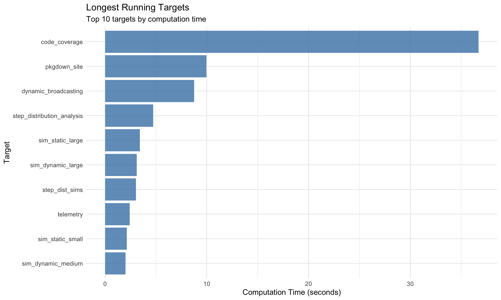
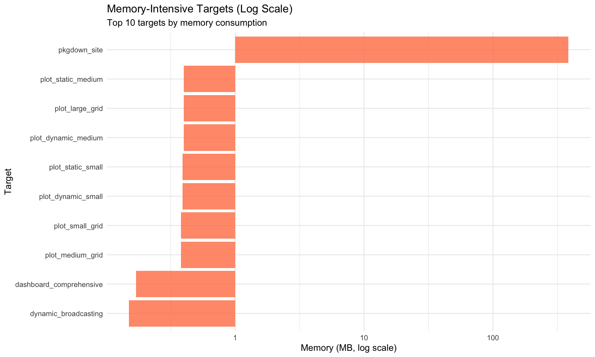
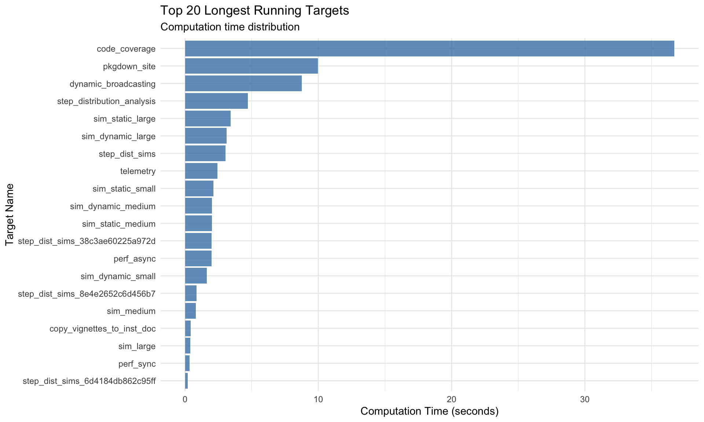
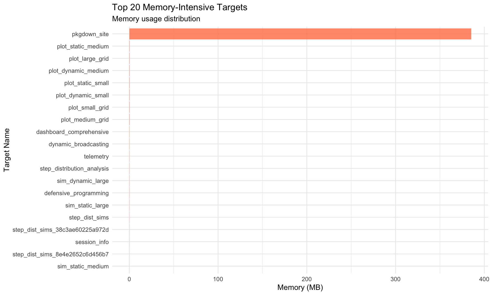
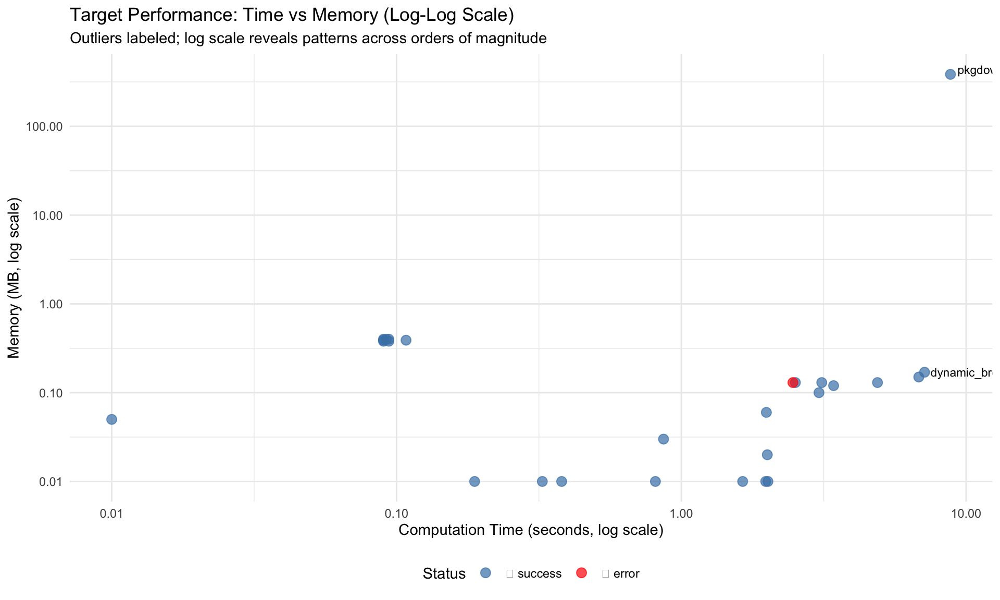
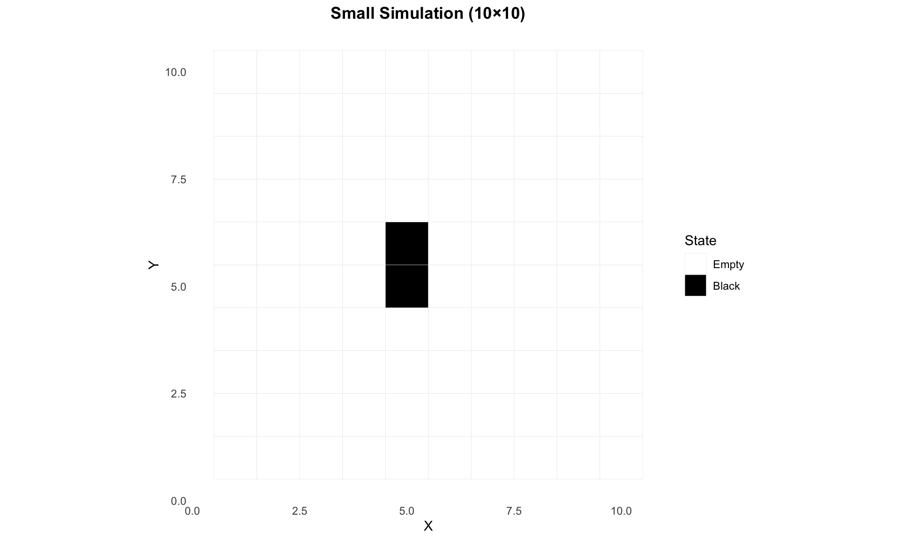
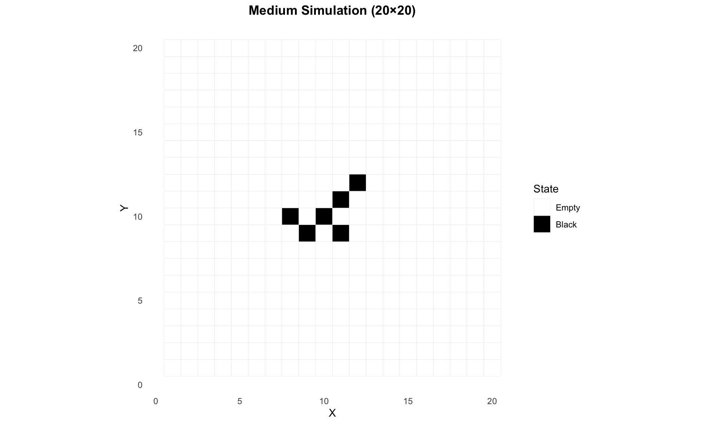

# Telemetry, Coverage, and Pipeline Performance

# Telemetry, Coverage, and Pipeline Performance

Pipeline metrics, code coverage, memory usage, and targets dependency
visualization

Author

randomwalk package

Published

January 1, 2026

# Overview

This vignette presents comprehensive telemetry for the `randomwalk`
package:

- **Code Coverage**: Test coverage analysis using `covr`
- **Pipeline Performance**: Execution time and memory usage via
  `targets`
- **Network Visualization**: Pipeline dependency graph
- **Performance Hotspots**: Longest-running targets and memory hogs
- **System Information**: Environment and reproducibility details

All metrics are pre-computed using the `targets` pipeline and loaded via
`tar_read()`.

# Package Information

Show code

``` r
# Load package metadata from targets pipeline
pkg_info <- tar_read(package_info)

# Display as formatted table
data.frame(
  Field = c("Package", "Version", "Title", "Generated"),
  Value = c(
    pkg_info$package,
    pkg_info$version,
    pkg_info$title,
    format(pkg_info$date, "%Y-%m-%d")
  )
) %>%
  kable(caption = "Package Metadata")
```

|  | Field | Value |
|:---|:---|:---|
| Package | Package | randomwalk |
| Version | Version | 2.1.0 |
| Title | Title | Asynchronous Pixel Walking Simulation with Parallel Processing |
|  | Generated | 2025-12-28 |

Package Metadata

# Code Coverage Analysis

Test coverage provides insight into which code paths are exercised by
the test suite.

## Overall Coverage

Show code

``` r
# Load pre-computed coverage from targets pipeline (if available)
cov_data <- tryCatch({
  tar_read(code_coverage)
}, error = function(e) NULL)

cov_available <- !is.null(cov_data)

if (cov_available) {
  cat(sprintf("Overall Test Coverage: %.1f%%\n", cov_data$overall_pct))
} else {
  cat("⚠️ Code coverage analysis is temporarily disabled.\n\n")
  cat("The covr::package_coverage() function encounters 'error reading from connection'\n")
  cat("in Nix environments. This is a known compatibility issue being tracked.\n\n")
  cat("To generate coverage locally:\n")
  cat("  coverage <- covr::package_coverage()\n")
  cat("  covr::report(coverage)\n")
}
```

    ⚠️ Code coverage analysis is temporarily disabled.

    The covr::package_coverage() function encounters 'error reading from connection'
    in Nix environments. This is a known compatibility issue being tracked.

    To generate coverage locally:
      coverage <- covr::package_coverage()
      covr::report(coverage)

## Coverage by File

Show code

``` r
# Use pre-computed file summary from targets (if available)
if (cov_available) {
  file_summary <- cov_data$file_summary

  file_summary %>%
    kable(
      digits = 1,
      col.names = c("File", "Total Lines", "Covered Lines", "Coverage (%)"),
      caption = "Test Coverage by File"
    )
} else {
  cat("Coverage data not available - code_coverage target is disabled\n")
}
```

    Coverage data not available - code_coverage target is disabled

## Coverage Visualization

Show code

``` r
if (cov_available) {
  file_summary %>%
    mutate(filename = reorder(filename, coverage_pct)) %>%
    ggplot(aes(x = filename, y = coverage_pct)) +
    geom_col(aes(fill = coverage_pct), alpha = 0.8) +
    geom_hline(yintercept = 80, linetype = "dashed", color = "red") +
    scale_fill_gradient2(
      low = "red", mid = "yellow", high = "green",
      midpoint = 50, limits = c(0, 100),
      name = "Coverage %"
    ) +
    coord_flip() +
    labs(
      title = "Test Coverage by File",
      subtitle = "Dashed line shows 80% coverage target",
      x = "File",
      y = "Coverage (%)"
    ) +
    theme_minimal() +
    theme(legend.position = "bottom")
} else {
  cat("Coverage visualization not available - code_coverage target is disabled\n")
}
```

    Coverage visualization not available - code_coverage target is disabled

## Untested Code Hotspots

Files with low coverage that need additional tests:

Show code

``` r
if (cov_available) {
  low_coverage <- file_summary %>%
    filter(coverage_pct < 80) %>%
    arrange(coverage_pct)

  if (nrow(low_coverage) > 0) {
    low_coverage %>%
      kable(
        digits = 1,
        col.names = c("File", "Total Lines", "Covered Lines", "Coverage (%)"),
        caption = "Files Below 80% Coverage (Need More Tests)"
      )
  } else {
    cat("✅ All files have >80% coverage!\n")
  }
} else {
  cat("Coverage data not available - code_coverage target is disabled\n")
}
```

    Coverage data not available - code_coverage target is disabled

# Pipeline Performance Telemetry

## Pipeline Network Visualization

The targets pipeline dependency graph shows how targets depend on each
other:

Show code

``` r
# Visualize the pipeline network
tar_visnetwork(
  targets_only = TRUE,
  label = c("time", "size", "branches")
)
```

**Interactive**: Click and drag nodes to explore dependencies. Hover for
details.

## Target Execution Statistics

### Summary Table

Show code

``` r
# Generate telemetry from tar_meta() - safe to call AFTER pipeline completes
telemetry <- tar_meta() %>%
  mutate(
    time_seconds = as.numeric(seconds, units = "secs"),
    time_formatted = sprintf("%.2fs", time_seconds),
    memory_mb = round(bytes / 1024^2, 2),
    status = ifelse(is.na(error), "✅ success", "❌ error")
  ) %>%
  filter(!is.na(time_seconds))

# Display sortable/filterable table using DT
telemetry %>%
  select(name, time_seconds, memory_mb, status) %>%
  rename(
    "Target Name" = name,
    "Time (sec)" = time_seconds,
    "Memory (MB)" = memory_mb,
    "Status" = status
  ) %>%
  datatable(
    caption = "Target Pipeline Execution Summary (click columns to sort, use search to filter)",
    filter = "top",
    options = list(
      pageLength = 15,
      order = list(list(1, "desc")),  # Sort by time descending
      columnDefs = list(
        list(className = "dt-right", targets = c(1, 2))
      )
    ),
    rownames = FALSE
  ) %>%
  formatRound(columns = c("Time (sec)", "Memory (MB)"), digits = 2)
```

### Performance Metrics

Show code

``` r
# Calculate summary statistics
total_time <- sum(telemetry$time_seconds, na.rm = TRUE)
total_memory <- sum(telemetry$memory_mb, na.rm = TRUE)
target_count <- nrow(telemetry)

data.frame(
  Metric = c("Total Targets", "Total Computation Time", "Total Memory Usage", "Average Time/Target", "Average Memory/Target"),
  Value = c(
    target_count,
    sprintf("%.1f seconds", total_time),
    sprintf("%.1f MB", total_memory),
    sprintf("%.2f seconds", total_time / target_count),
    sprintf("%.2f MB", total_memory / target_count)
  )
) %>%
  kable(caption = "Pipeline Performance Summary")
```

| Metric                 | Value        |
|:-----------------------|:-------------|
| Total Targets          | 38           |
| Total Computation Time | 94.1 seconds |
| Total Memory Usage     | 389.2 MB     |
| Average Time/Target    | 2.48 seconds |
| Average Memory/Target  | 10.24 MB     |

Pipeline Performance Summary

## Longest Running Targets

Targets that take the most time to compute:

Show code

``` r
# Top 10 longest running targets
longest <- telemetry %>%
  arrange(desc(time_seconds)) %>%
  head(10) %>%
  select(name, time_formatted, memory_mb)

longest %>%
  kable(
    col.names = c("Target", "Computation Time", "Memory (MB)"),
    caption = "Top 10 Longest Running Targets"
  )
```

| Target                     | Computation Time | Memory (MB) |
|:---------------------------|:-----------------|------------:|
| code_coverage              | 36.70s           |        0.00 |
| pkgdown_site               | 8.81s            |      385.19 |
| dashboard_comprehensive    | 7.15s            |        0.17 |
| dynamic_broadcasting       | 6.82s            |        0.15 |
| step_distribution_analysis | 4.88s            |        0.13 |
| sim_static_large           | 3.42s            |        0.12 |
| sim_dynamic_large          | 3.11s            |        0.13 |
| step_dist_sims             | 3.04s            |        0.10 |
| defensive_programming      | 2.52s            |        0.13 |
| telemetry                  | 2.46s            |        0.13 |

Top 10 Longest Running Targets

### Longest Running Targets Visualization

Show code

``` r
longest %>%
  mutate(
    name = reorder(name, telemetry$time_seconds[match(name, telemetry$name)]),
    time_secs = telemetry$time_seconds[match(name, telemetry$name)]
  ) %>%
  ggplot(aes(x = name, y = time_secs)) +
  geom_col(fill = "steelblue", alpha = 0.8) +
  coord_flip() +
  labs(
    title = "Longest Running Targets",
    subtitle = "Top 10 targets by computation time",
    x = "Target",
    y = "Computation Time (seconds)"
  ) +
  theme_minimal()
```



Top 10 longest running targets

**Optimization Opportunities**: Consider caching or optimizing these
targets to improve pipeline performance.

## Highest Memory Targets

Targets that consume the most memory:

Show code

``` r
# Top 10 highest memory targets
memory_hogs <- telemetry %>%
  arrange(desc(memory_mb)) %>%
  head(10) %>%
  select(name, memory_mb, time_formatted)

memory_hogs %>%
  kable(
    col.names = c("Target", "Memory (MB)", "Computation Time"),
    caption = "Top 10 Memory-Intensive Targets"
  )
```

| Target                  | Memory (MB) | Computation Time |
|:------------------------|------------:|:-----------------|
| pkgdown_site            |      385.19 | 8.81s            |
| plot_large_grid         |        0.40 | 0.09s            |
| plot_static_medium      |        0.40 | 0.09s            |
| plot_dynamic_medium     |        0.40 | 0.09s            |
| plot_static_small       |        0.39 | 0.11s            |
| plot_dynamic_small      |        0.39 | 0.09s            |
| plot_medium_grid        |        0.38 | 0.09s            |
| plot_small_grid         |        0.38 | 0.09s            |
| dashboard_comprehensive |        0.17 | 7.15s            |
| dynamic_broadcasting    |        0.15 | 6.82s            |

Top 10 Memory-Intensive Targets

### Memory Usage Visualization

Show code

``` r
memory_hogs %>%
  mutate(
    name = reorder(name, telemetry$memory_mb[match(name, telemetry$name)]),
    memory = telemetry$memory_mb[match(name, telemetry$name)]
  ) %>%
  ggplot(aes(x = name, y = memory)) +
  geom_col(fill = "coral", alpha = 0.8) +
  coord_flip() +
  scale_y_log10(labels = scales::comma_format()) +
  labs(
    title = "Memory-Intensive Targets (Log Scale)",
    subtitle = "Top 10 targets by memory consumption",
    x = "Target",
    y = "Memory (MB, log scale)"
  ) +
  theme_minimal()
```



Top 10 memory-intensive targets (log scale)

**Storage Optimization**: High-memory targets may benefit from
compression or data format optimization.

## Computation Time Distribution

Show code

``` r
telemetry %>%
  arrange(desc(time_seconds)) %>%
  head(20) %>%
  mutate(name = reorder(name, time_seconds)) %>%
  ggplot(aes(x = name, y = time_seconds)) +
  geom_col(fill = "steelblue", alpha = 0.8) +
  coord_flip() +
  labs(
    title = "Top 20 Longest Running Targets",
    subtitle = "Computation time distribution",
    x = "Target Name",
    y = "Computation Time (seconds)"
  ) +
  theme_minimal()
```



Computation time distribution across all targets

## Memory Usage Distribution

Show code

``` r
telemetry %>%
  arrange(desc(memory_mb)) %>%
  head(20) %>%
  mutate(name = reorder(name, memory_mb)) %>%
  ggplot(aes(x = name, y = memory_mb)) +
  geom_col(fill = "coral", alpha = 0.8) +
  coord_flip() +
  scale_y_log10(labels = scales::comma_format()) +
  labs(
    title = "Top 20 Memory-Intensive Targets (Log Scale)",
    subtitle = "Memory usage distribution",
    x = "Target Name",
    y = "Memory (MB, log scale)"
  ) +
  theme_minimal()
```



Memory usage distribution across all targets (log scale)

# Performance Trends

## Time vs Memory Scatter

Relationship between computation time and memory usage (log-log scale
for better visualization of range):

Show code

``` r
# Filter out zero/NA values for log scale
plot_data <- telemetry %>%
  filter(time_seconds > 0, memory_mb > 0)

plot_data %>%
  ggplot(aes(x = time_seconds, y = memory_mb)) +
  geom_point(aes(color = status), size = 3, alpha = 0.7) +
  geom_text(
    data = plot_data %>% filter(time_seconds > quantile(time_seconds, 0.9) | memory_mb > quantile(memory_mb, 0.9)),
    aes(label = name),
    hjust = -0.1,
    vjust = -0.1,
    size = 3,
    check_overlap = TRUE
  ) +
  scale_x_log10(labels = scales::comma_format()) +
  scale_y_log10(labels = scales::comma_format()) +
  scale_color_manual(
    values = c("✅ success" = "steelblue", "❌ error" = "red"),
    name = "Status"
  ) +
  labs(
    title = "Target Performance: Time vs Memory (Log-Log Scale)",
    subtitle = "Outliers labeled; log scale reveals patterns across orders of magnitude",
    x = "Computation Time (seconds, log scale)",
    y = "Memory (MB, log scale)"
  ) +
  theme_minimal() +
  theme(legend.position = "bottom")
```



Computation time vs memory usage (log-log scale)

**Key Observations**: - Targets in upper-right quadrant (high time, high
memory) are optimization candidates - Targets with disproportionate
time/memory ratios may have inefficiencies

# Example Simulations

## Small Simulation

A small 10×10 grid simulation with 3 walkers:

Show code

``` r
# Load pre-computed statistics
stats_small <- tar_read(stats_small)

# Display statistics
if (is.data.frame(stats_small) || is.list(stats_small)) {
  print(stats_small)
} else {
  cat("Statistics available but format not suitable for display\n")
}
```

    $black_pixels
    [1] 2

    $black_percentage
    [1] 2

    $grid_size
    [1] 10

    $total_walkers
    [1] 3

    $completed_walkers
    [1] 3

    $total_steps
    [1] 7

    $min_steps
    [1] 0

    $max_steps
    [1] 6

    $mean_steps
    [1] 2.333333

    $median_steps
    [1] 1

    $percentile_25
    25% 
    0.5 

    $percentile_75
    75% 
    3.5 

    $elapsed_time_secs
    [1] 0.00956893

    $termination_reasons

    black_neighbor   hit_boundary 
                 1              2 

Show code

``` r
# Load pre-computed plot
tar_read(plot_small_grid)
```



Small simulation grid visualization

## Medium Simulation

A medium 20×20 grid simulation with 5 walkers:

Show code

``` r
# Load pre-computed statistics
stats_medium <- tar_read(stats_medium)

# Display statistics
if (is.data.frame(stats_medium) || is.list(stats_medium)) {
  print(stats_medium)
} else {
  cat("Statistics available but format not suitable for display\n")
}
```

    $black_pixels
    [1] 6

    $black_percentage
    [1] 1.5

    $grid_size
    [1] 20

    $total_walkers
    [1] 5

    $completed_walkers
    [1] 5

    $total_steps
    [1] 3163

    $min_steps
    [1] 308

    $max_steps
    [1] 1205

    $mean_steps
    [1] 632.6

    $median_steps
    [1] 582

    $percentile_25
    25% 
    434 

    $percentile_75
    75% 
    634 

    $elapsed_time_secs
    [1] 0.230211

    $termination_reasons

    black_neighbor 
                 5 

Show code

``` r
# Load pre-computed plot
tar_read(plot_medium_grid)
```



Medium simulation grid visualization

# System Information

## R Session Information

Complete session information including R version, platform, and loaded
packages:

Show code

``` r
# Load session info from targets pipeline
sess_info <- tar_read(session_info)

# Display formatted session info
print(sess_info)
```

    R version 4.5.2 (2025-10-31)
    Platform: aarch64-apple-darwin24.6.0
    Running under: macOS Sequoia 15.7.1

    Matrix products: default
    BLAS:   /nix/store/jammm5gz621n7dkzfzc1c43gs6xv9a10-blas-3/lib/libblas.dylib 
    LAPACK: /nix/store/30ypx3jnyq4r1z4nv742j1csfflsd66v-openblas-0.3.30/lib/libopenblasp-r0.3.30.dylib;  LAPACK version 3.12.0

    locale:
    [1] en_US.UTF-8/en_US.UTF-8/en_US.UTF-8/C/en_US.UTF-8/en_US.UTF-8

    time zone: UTC
    tzcode source: internal

    attached base packages:
    [1] stats     graphics  grDevices utils     datasets  methods   base     

    other attached packages:
     [1] randomwalk_2.1.0   testthat_3.2.3     quarto_1.5.1       pkgdown_2.1.3     
     [5] logger_0.4.1       ggplot2_4.0.0      DT_0.34.0          dplyr_1.1.4       
     [9] devtools_2.4.6     usethis_3.2.1      tarchetypes_0.13.2 targets_1.11.4    

    loaded via a namespace (and not attached):
     [1] gtable_0.3.6       xfun_0.54          htmlwidgets_1.6.4  remotes_2.5.0     
     [5] processx_3.8.6     callr_3.7.6        vctrs_0.6.5        tools_4.5.2       
     [9] ps_1.9.1           generics_0.1.4     base64url_1.4      parallel_4.5.2    
    [13] tibble_3.3.0       pkgconfig_2.0.3    mirai_2.5.1        data.table_1.17.8 
    [17] secretbase_1.0.5   RColorBrewer_1.1-3 S7_0.2.0           desc_1.4.3        
    [21] lifecycle_1.0.4    compiler_4.5.2     farver_2.1.2       brio_1.1.5        
    [25] codetools_0.2-20   htmltools_0.5.8.1  yaml_2.3.10        later_1.4.4       
    [29] pillar_1.11.1      crew_1.3.0         ellipsis_0.3.2     autometric_0.1.2  
    [33] cachem_1.1.0       sessioninfo_1.2.3  tidyselect_1.2.1   digest_0.6.37     
    [37] purrr_1.1.0        rprojroot_2.1.1    fastmap_1.2.0      grid_4.5.2        
    [41] cli_3.6.5          magrittr_2.0.4     pkgbuild_1.4.8     withr_3.0.2       
    [45] promises_1.5.0     prettyunits_1.2.0  scales_1.4.0       backports_1.5.0   
    [49] rmarkdown_2.30     otel_0.2.0         igraph_2.2.1       memoise_2.0.1     
    [53] evaluate_1.0.5     knitr_1.50         rlang_1.1.6        Rcpp_1.1.0        
    [57] nanonext_1.7.2     glue_1.8.0         collections_0.3.9  pkgload_1.4.1     
    [61] rstudioapi_0.17.1  jsonlite_2.0.0     R6_2.6.1           fs_1.6.6          

## Git/GitHub Summary

Version control and repository information:

Show code

``` r
# Load git summary from targets pipeline
git_info <- tar_read(git_summary)

# Display as formatted table
data.frame(
  Field = c("Branch", "Commit", "Remote", "Status"),
  Value = c(
    git_info$branch,
    git_info$commit,
    basename(git_info$remote),
    if (length(git_info$status) == 0) "Clean" else "Modified"
  )
) %>%
  kable(caption = "Git Repository Information")
```

| Field  | Value          |
|:-------|:---------------|
| Branch | main           |
| Commit | f6e034c        |
| Remote | randomwalk.git |
| Status | Modified       |

Git Repository Information

# Pipeline Reproducibility

All objects displayed in this vignette are pre-computed and stored in
the targets pipeline. To reproduce these results:

1.  Ensure you have the required packages installed (see DESCRIPTION)
2.  Run `targets::tar_make()` to execute the pipeline
3.  Render this vignette to see the updated results

Show code

``` r
# Reproduce the pipeline
targets::tar_make()

# View the pipeline network
targets::tar_visnetwork()

# Check target status
targets::tar_meta()

# View longest-running targets
tar_meta() %>%
  arrange(desc(seconds)) %>%
  select(name, seconds, bytes) %>%
  head(10)

# Generate coverage report
library(covr)
coverage <- package_coverage()
report(coverage)
```

# Performance Recommendations

Based on the telemetry analysis:

## High-Priority Optimizations

Show code

``` r
# Identify optimization candidates
candidates <- telemetry %>%
  mutate(
    time_percentile = percent_rank(time_seconds),
    memory_percentile = percent_rank(memory_mb),
    priority_score = time_percentile + memory_percentile
  ) %>%
  filter(priority_score > 1.5) %>%  # Top 25% in both dimensions
  arrange(desc(priority_score)) %>%
  select(name, time_formatted, memory_mb, priority_score)

if (nrow(candidates) > 0) {
  candidates %>%
    kable(
      digits = 2,
      col.names = c("Target", "Time", "Memory (MB)", "Priority Score"),
      caption = "Optimization Candidates (High Time + High Memory)"
    )
} else {
  cat("No high-priority optimization candidates identified.\n")
}
```

| Target                     | Time  | Memory (MB) | Priority Score |
|:---------------------------|:------|------------:|---------------:|
| pkgdown_site               | 8.81s |      385.19 |           1.97 |
| dashboard_comprehensive    | 7.15s |        0.17 |           1.73 |
| dynamic_broadcasting       | 6.82s |        0.15 |           1.68 |
| step_distribution_analysis | 4.88s |        0.13 |           1.54 |

Optimization Candidates (High Time + High Memory)

## Recommended Actions

1.  **Cache expensive targets**: Use `tar_target(format = "qs")` for
    large objects
2.  **Parallelize independent targets**: Use `tar_make_future()` or
    `tar_make_clustermq()`
3.  **Optimize algorithms**: Review code for longest-running targets
4.  **Reduce memory footprint**: Use memory-efficient data structures
5.  **Add test coverage**: Focus on files with \<80% coverage

# Summary

This telemetry vignette provides comprehensive performance insights:

- **Code Coverage**: `covr` package analysis identifies untested code
- **Pipeline Performance**: Execution time and memory usage per target
- **Performance Hotspots**: Longest-running and memory-intensive targets
  identified
- **Network Visualization**: `tar_visnetwork()` shows pipeline
  dependencies
- **Optimization Guidance**: Data-driven recommendations for
  improvements
- **Reproducibility**: Version control and system information

All statistics are generated automatically from the targets pipeline,
ensuring consistency across builds.

------------------------------------------------------------------------

*Generated on: 2026-01-01 15:22:42.234013*

*Using targets pipeline from: `_targets.R`*

## Session Info

Show code

``` r
sessionInfo()
```

    R version 4.5.2 (2025-10-31)
    Platform: aarch64-apple-darwin24.6.0
    Running under: macOS Sequoia 15.7.1

    Matrix products: default
    BLAS:   /nix/store/jammm5gz621n7dkzfzc1c43gs6xv9a10-blas-3/lib/libblas.dylib 
    LAPACK: /nix/store/30ypx3jnyq4r1z4nv742j1csfflsd66v-openblas-0.3.30/lib/libopenblasp-r0.3.30.dylib;  LAPACK version 3.12.0

    locale:
    [1] en_US.UTF-8/en_US.UTF-8/en_US.UTF-8/C/en_US.UTF-8/en_US.UTF-8

    time zone: Europe/Dublin
    tzcode source: internal

    attached base packages:
    [1] stats     graphics  grDevices utils     datasets  methods   base     

    other attached packages:
    [1] randomwalk_2.1.0 testthat_3.2.3   DT_0.34.0        tidyr_1.3.1     
    [5] knitr_1.50       ggplot2_4.0.0    dplyr_1.1.4      targets_1.11.4  

    loaded via a namespace (and not attached):
     [1] sass_0.4.10        generics_0.1.4     digest_0.6.37      magrittr_2.0.4    
     [5] evaluate_1.0.5     grid_4.5.2         RColorBrewer_1.1-3 pkgload_1.4.1     
     [9] fastmap_1.2.0      rprojroot_2.1.1    jsonlite_2.0.0     processx_3.8.6    
    [13] pkgbuild_1.4.8     sessioninfo_1.2.3  brio_1.1.5         backports_1.5.0   
    [17] secretbase_1.0.5   ps_1.9.1           purrr_1.1.0        crosstalk_1.2.2   
    [21] scales_1.4.0       jquerylib_0.1.4    codetools_0.2-20   cli_3.6.5         
    [25] rlang_1.1.6        ellipsis_0.3.2     remotes_2.5.0      withr_3.0.2       
    [29] cachem_1.1.0       yaml_2.3.10        devtools_2.4.6     tools_4.5.2       
    [33] memoise_2.0.1      base64url_1.4      logger_0.4.1       vctrs_0.6.5       
    [37] R6_2.6.1           lifecycle_1.0.4    fs_1.6.6           htmlwidgets_1.6.4 
    [41] usethis_3.2.1      desc_1.4.3         pkgconfig_2.0.3    callr_3.7.6       
    [45] bslib_0.9.0        pillar_1.11.1      gtable_0.3.6       data.table_1.17.8 
    [49] glue_1.8.0         xfun_0.54          tibble_3.3.0       tidyselect_1.2.1  
    [53] rstudioapi_0.17.1  farver_2.1.2       htmltools_0.5.8.1  igraph_2.2.1      
    [57] labeling_0.4.3     rmarkdown_2.30     compiler_4.5.2     prettyunits_1.2.0 
    [61] S7_0.2.0          

## Version Information

Show version details

``` r
# Collect all version/build information
version_info <- data.frame(
  Category = character(),
  Item = character(),
  Value = character(),
  stringsAsFactors = FALSE
)

# Git information
git_commit <- tryCatch(system("git rev-parse HEAD", intern = TRUE), error = function(e) NA)
git_commit_short <- tryCatch(system("git rev-parse --short HEAD", intern = TRUE), error = function(e) NA)
git_branch <- tryCatch(system("git rev-parse --abbrev-ref HEAD", intern = TRUE), error = function(e) NA)

version_info <- rbind(version_info, data.frame(
  Category = "Git",
  Item = c("Branch", "Commit (short)", "Commit (full)"),
  Value = c(
    ifelse(is.na(git_branch), "Not available", git_branch),
    ifelse(is.na(git_commit_short), "Not available", git_commit_short),
    ifelse(is.na(git_commit), "Not available", git_commit)
  )
))

# Package versions
pkg_version <- tryCatch(as.character(packageVersion("randomwalk")), error = function(e) NA)

version_info <- rbind(version_info, data.frame(
  Category = "Packages",
  Item = c("randomwalk", "R", "targets", "ggplot2"),
  Value = c(
    ifelse(is.na(pkg_version), "Not loaded", pkg_version),
    R.version.string,
    as.character(packageVersion("targets")),
    as.character(packageVersion("ggplot2"))
  )
))

# Environment
nix_version <- tryCatch(
  gsub('"', '', system('nix-instantiate --eval -E "(import <nixpkgs> {}).lib.version"', intern = TRUE)),
  error = function(e) NA
)

version_info <- rbind(version_info, data.frame(
  Category = "Environment",
  Item = c("Platform", "Nix", "Build Time"),
  Value = c(
    R.version$platform,
    ifelse(is.na(nix_version), "Not in Nix environment", nix_version),
    format(Sys.time(), "%Y-%m-%d %H:%M:%S %Z")
  )
))

# Display as clean table
version_info %>%
  kable(
    col.names = c("Category", "Item", "Value"),
    caption = "Build and Version Information"
  )
```

| Category    | Item           | Value                                    |
|:------------|:---------------|:-----------------------------------------|
| Git         | Branch         | main                                     |
| Git         | Commit (short) | f76d66e                                  |
| Git         | Commit (full)  | f76d66ed0027eb7a289ba018cca51ace71aab6fd |
| Packages    | randomwalk     | 2.1.0                                    |
| Packages    | R              | R version 4.5.2 (2025-10-31)             |
| Packages    | targets        | 1.11.4                                   |
| Packages    | ggplot2        | 4.0.0                                    |
| Environment | Platform       | aarch64-apple-darwin24.6.0               |
| Environment | Nix            | 26.05pre-git                             |
| Environment | Build Time     | 2026-01-01 15:22:42 GMT                  |

Build and Version Information
